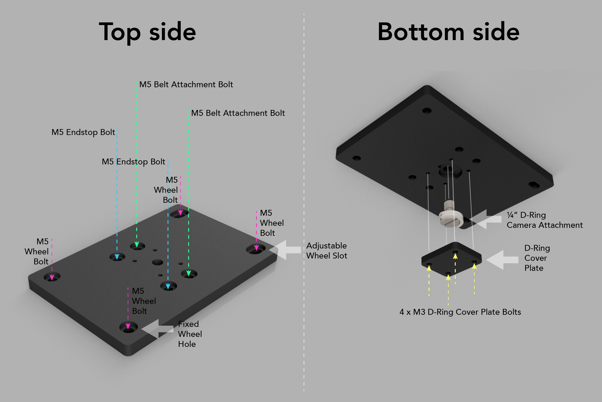
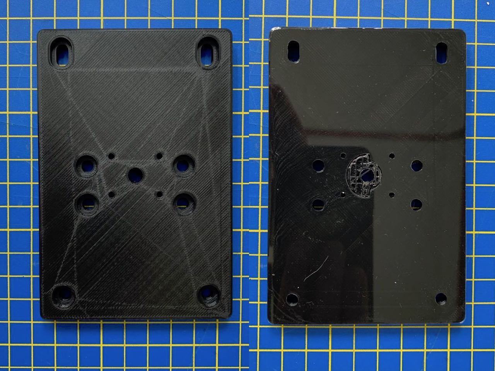
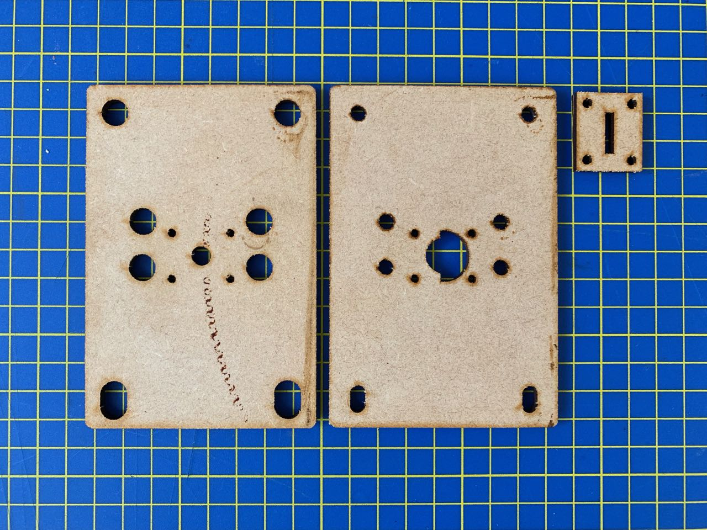

# Gantry Assembly guide

The gantry has a number of parts:

* Main gantry plate
  * The large flat piece onto which everything else is attached, including the camera.
* D-Ring cover plate
  * A small extra plate that screws onto the underside of the gantry to capture the D-ring camera screw from underneath.
* Wheels
  * 4 wheel assemblies: 2 fixed, and 2 in slots so the tightness of the wheels against the rail can be adjusted.
* End-stop bolts
  * 2 long bolts (approx 40 mm) that pass through from the top of the gantry down to the underside. These make contact with the end-stops at each end of the slider. (These are slightly more offset from the centre than the belt attachment bolts.)
* Belt attachment bolts
  * 2 bolts, approx 20-30 mm, around which each end of the timing belt is wrapped, and then secured with a cable tie. (These are slightly offset from the centre of the gantry – the distance is determined by the radius of the belt pulleys.)

## 2D and 3D versions

The gantry is pretty much a flat piece, but has recesses for bolt heads, and in particular for the D-ring 1/4" screw onto which the camera is mounted. I 3D-printed this part, but it is possible to make it from 3 laser-cut sheets glued together.

### 3D-printed gantry

The bottom side (on the right) shows the support still to be removed where the D-ring camera screw sits.

The coverplate is a separate piece not show here.

### Laser-cut gantry

The two main parts are simply glued together, with the cover plate screwed on afterwards.

