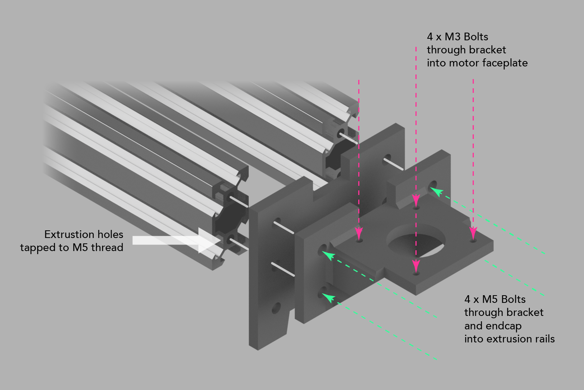

# Motor Mounting Bracket

This is a very simple bracket that mounts a standard NEMA 17-size motor through the end-cap piece into the central holes of  two pieces of 2040 extrusion mounted 40 mm apart.

This mounting approach relies on the extrusion having M5 holes tapped into the central holes. Some suppliers (like Ooznest) will do this for you, or you can do it yourself.

If you don't have threads tapped in your extrusion, this style of attachment may not be the best approach.
