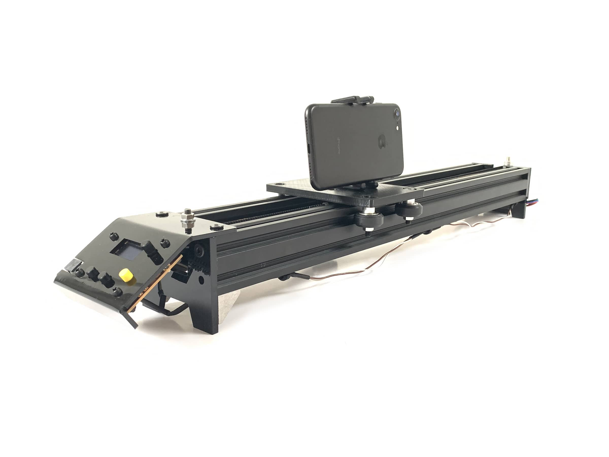

# Fab Slider

A fab-able DIY motorised camera slider

* [The (Arduino Nano) microcontroller, user controls and TMC2130 stepper driver are all integrated onto one board here](boards/driver-arduino-shield/v3)
* [3D and 2D files for the assembly are all here](3d-parts/v1)
* [Arduino sketch here](arduino-code/v2)

This project is designed to be easily replicated, adapted or hacked on by anyone with access to typical fablab tools. 

It's primarily an exercise in learning: how to use a 3D printer; how use an Arduino; how to design circuit boards; how to assemble a machine, and so on. 

So really, it's all about the documentation, which is here:

* <https://andrewsleigh.com/fab-slider/>
* Or see [`docs/_posts/`](docs/_posts/) in this repo