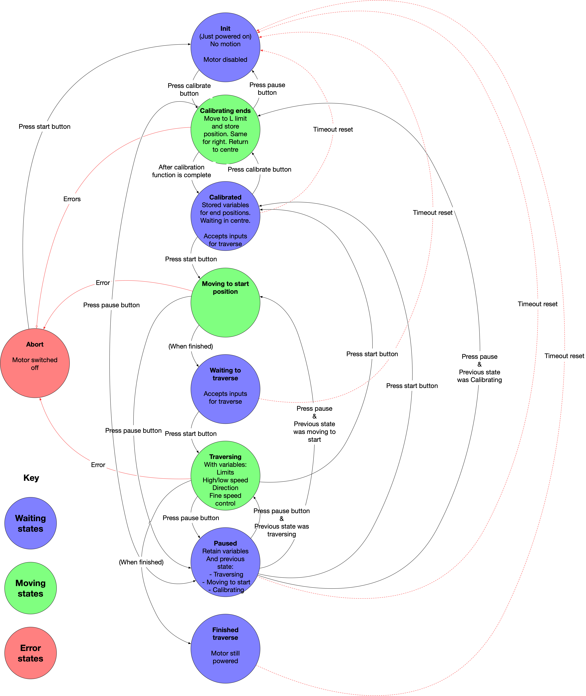

# Readme

Note this code is not finished, or even working properly. I'm just sharing it because it marks the most complete version of my code before I simplified the design of the state machine. 

For a detailed explanation, please see the documentation.

Here is a diagram of the state machine I'm building in this code:

