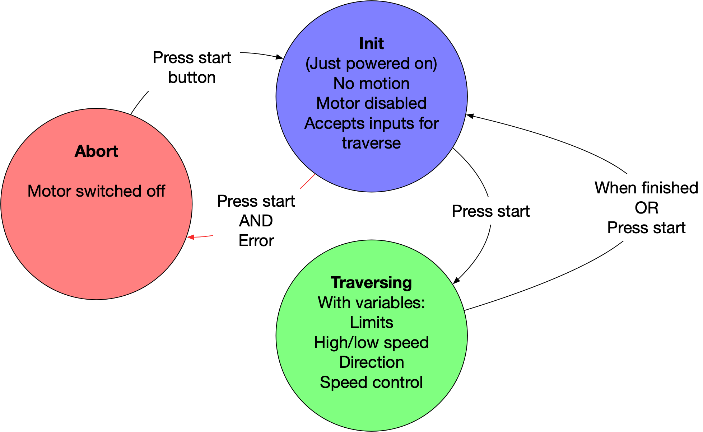

# Readme


## Recent changes

Some small modification following testing for version 2.1

* Slowed down timelapse speed range (from min 50 / max 250 to min 2 / max 50
* Changed GUI behaviour to include full information on settings (still non-interactive) while traversing
* Automatically switches directions after hitting end-stop


## State machine

Here is a diagram of the simpler state machine I'm building in this code:



<hr/>

This is a lightly documented version of the code for the first release version of my camera slider (v2 in this repo). This is much simplified from the old complex state machine (and quite similar to the v1 code). 


## Libraries

I'm using these Arduino libraries to handle motor control, non-blocking timers, button debouncing and OLED graphics respectively:

```
#include <AccelStepper.h>
#include <neotimer.h>
#include <Bounce2.h>

// OLED
#include <U8g2lib.h>
#include <SPI.h>
#include <Wire.h>
```


## User configuration

The variables that you might want to change are listed at the top of the file so speeds can be tweaked


```
int videoMinSpeed = 500;
int videoMaxSpeed = 5000;
int timelapseMinSpeed = 50;
int timelapseMaxSpeed = 250;
int endStopPadding = 300; // a safe distance to disengage the gantry from the end stops 
```


## Debugging setup

As documented in [Better debugging with the serial monitor](https://andrewsleigh.com/fab-slider/coding-better-debugging/) (or [GitHub link](https://github.com/andrewsleigh/fab-slider/blob/master/docs/_posts/2019-05-12-coding-better-debugging.md)), this section sets up the definitions that allow you to switch serial debugging on and off. You'd want to turn it off in use because sending all that data to the serial monitor interrupts the motion of the stepper.

```
String errorMessage = ""; // this string needs to be initialised even if we're not running debugging


// comment these out to remove debugging
//#define DEBUG // needed for all debugging
//#define DEBUG_TIMER // for messages that print every few seconds
//#define DEBUG_STATE_CHANGE // for messages that print only on a change in the machine state

#ifdef DEBUG

// set up debug timer
Neotimer statusUpdateTimer = Neotimer();

// set up string messages
#define DEBUG_PRINT(str)    \
  Serial.print(str); \
  Serial.print(" ------ ");      \
  Serial.print("In ");    \
  Serial.print(__PRETTY_FUNCTION__); \
  Serial.print(", line: ");      \
  Serial.println(__LINE__);     \

#else
#define DEBUG_PRINT(str) // just leaves an empty definition without serial printing
#endif


```

## Creating objects and variables

After that we just setup all the objects and variables we'll use later. These settings are tweaked for the new shield I designed for an Arduino Nano board and TMC2130 driver.

```
// Accelstepper object
// Revised for nano shield. Format: interface, step pin, direction pin
AccelStepper stepper(AccelStepper::DRIVER, 3, 2);

// Instantiate Bounce objects for buttons
Bounce debouncer_start = Bounce();
Bounce debouncer_mode = Bounce();
Bounce debouncer_direction = Bounce();

// define input/button pin numbers
const int startButtonPin = A3;
const int leftEndStopPin = 6;
const int rightEndStopPin = 5;
const int startFromLeftPin = 7;
const int isTimelapseSpeedPin = 8;

// define output pin numbers
const int motorOffPin = 4;

// define analogue input for speed knob
const int speedPotPin = A2; // revised for nano
int speedInput = 0; // a variable to stare it in
int traverseSpeed = 0; // variable to hold speed when calculated

// variables to determine kind of traverse
bool startFromLeft = true;
bool isTimelapseSpeed = false;

```


## Setup state machine

As part of this, there is a section for the state machine itself:

```
// WARNING: values, order of items and total number of items must match the array below
enum possibleStates {
  INIT,
  TRAVERSING,
  ABORTED
};

// create an array of labels from the enum for debugging
// WARNING: this array must be updated if you change the enum
String stateLabels[3] = {
  "INIT",
  "TRAVERSING",
  "ABORTED"
};

// create a variable of this type
enum possibleStates currentState;

// keep track of whether the state has changed to limit status message updates
bool isNewState;
```

## Initialise OLED Library

My OLED module has I2C pins, so it's important to use the `HW_I2C` keyword in the constructor. I intially used the software I2C mode and it made everything run very slowly. 

Also, after much troubleshooting, I found that I had to initialise the variable that sets the width of the speed indicator on screen up here. If I initialised it inside the `loop()` where I was handling the screen drawing, bad things happened.

```
// OLED library constructor
// Use hardware I2C to avoid code running like treacle
U8G2_SSD1306_128X64_NONAME_2_HW_I2C u8g2 (U8G2_R0, A5, A4);

// instantiate variable to hold width of speed indicator bar. Seems to cuase problems if you create this at the point of use.
float speedBoxWidth = 5;
```

## Setup()

In `setup()` we:
* Set values for the motor
* Set values for the timer
* Open serial comms, if debugging is enabled
* Set up the switches with internal pullup resistors (so they're pulled low to activate)
* Set up output pins for the motor enable function
* Use the debounce library to set up our push-buttons
* Set the starting state, ready for the loop
* Setup the OLED screen ("[This function will reset, configure, clear and disable power save mode of the display](https://github.com/olikraus/u8g2/wiki/u8g2reference#begin)")

```
void setup() {
  stepper.setMaxSpeed(4000); // See https://forum.arduino.cc/index.php?topic=487134.0
  stepper.setAcceleration(2000.0);


#ifdef DEBUG
  Serial.begin(9600); // serial comms for debugging

  // set up  debug message timer
  statusUpdateTimer.set(2000);
#endif

  // initialize the button pins as inputs:
  pinMode(leftEndStopPin, INPUT_PULLUP);
  pinMode(rightEndStopPin, INPUT_PULLUP);

  // initialise output pin
  pinMode(motorOffPin, OUTPUT);

  // Debounced buttons
  debouncer_start.attach(startButtonPin, INPUT_PULLUP); // Attach the debouncer to a pin with INPUT_PULLUP mode
  debouncer_start.interval(25); // Use a debounce interval of 25 milliseconds
  debouncer_direction.attach(startFromLeftPin, INPUT_PULLUP);
  debouncer_direction.interval(25);
  debouncer_mode.attach(isTimelapseSpeedPin, INPUT_PULLUP);
  debouncer_mode.interval(25);

  // set startup state
  currentState = INIT;
  isNewState = true;

  // OLED
  u8g2.begin();
}  
```


## Loop()

Inside the main loop, we first check the state of the push-buttons.

Then we switch through all of the possible machine states, printing any debug messages if required, calling the functions for that state, and checking to see if the push button has been pressed in case we need to switch to a different state. All the OLED drawing is also handled inside this loop 

After the state machine switch, we just check to see if continuous debug messages need to be printed.

```
void loop() {

  // Debounced  buttons
  debouncer_start.update(); // Update the Bounce instance
  debouncer_mode.update();
  debouncer_direction.update();


  switch (currentState) {
    case INIT:

#ifdef DEBUG_STATE_CHANGE
      if (isNewState) {
        printDebugMessages();
        isNewState = false;
      }
#endif

      switchOffMotor();      // disable motor until we need it

      getControlInputs();    // get values for all the motion control variables

      // OLED
      speedBoxWidth = map(analogRead(speedPotPin), 0, 1023, 124, 4); // reverse the reading from the pot because it's wired up the other way around
      // reduce resolution to avoid jittery display
      speedBoxWidth = round(speedBoxWidth / 4);
      speedBoxWidth = speedBoxWidth * 4;


      u8g2.firstPage();
      do {
        u8g2.setFont(u8g2_font_helvB14_tr);
        u8g2.drawStr(0, 14, "Ready");
        u8g2.setFont(u8g2_font_helvB08_tr); // monospace
        // Speed
        u8g2.drawRFrame(0, 22, 128, 16, 3);
        u8g2.drawRBox(2, 24, speedBoxWidth, 12, 1);
        // mode backgrounds
        u8g2.drawBox(0, 42, 62, 15);
        u8g2.drawTriangle(12, 56,  20, 64,  28, 56);
        u8g2.drawBox(66, 42, 62, 15);
        u8g2.drawTriangle(100, 56,  108, 64,  116, 56);
        u8g2.setDrawColor(0);
        if (isTimelapseSpeed) {
          u8g2.setCursor(70, 53); // different padding for each string
          u8g2.print("Timelapse");
        } else {
          u8g2.setCursor(82, 53);
          u8g2.print("Video");
        }

        u8g2.setCursor(13, 53); // add some padding to the left
        if (startFromLeft) {
          u8g2.print("L >> R");
        } else {
          u8g2.print("R >> L");
        }

        u8g2.setDrawColor(1); // reset color
      }

      while ( u8g2.nextPage() );

      if ( debouncer_start.fell() ) {
        // first, check both end stops are connected and not currently closed


        // if ((!startFromLeft && digitalRead(leftEndStopPin) == HIGH) || (startFromLeft && digitalRead(rightEndStopPin) == HIGH)) {
        // The problem with this error check is that the traverse will stop as soon as it hits an end stop.
        // Easier just to force the user to move gantry off end stop at start

        if (digitalRead(rightEndStopPin) == HIGH || digitalRead(leftEndStopPin) == HIGH) {
          switchOffMotor; // just in case
          errorMessage = "End stop closed, or not connected";
          currentState = ABORTED;
          isNewState = true;
        } else { // otherwise, it's safe to start traverse


          // OLED
          // This is a bit of a hack. Ideally you'd write to the screen inside the traverse state.
          // But doing it here, just before entering that state, avoids interfering with motion

          u8g2.firstPage();
          do {
            u8g2.setFont(u8g2_font_helvB14_tr);
            u8g2.drawStr(0, 24, "Traversing");
          } while ( u8g2.nextPage() );

          currentState = TRAVERSING;
          isNewState = true;
        }
      }
      break;

    case TRAVERSING:

#ifdef DEBUG_STATE_CHANGE
      if (isNewState) {
        printDebugMessages();
        isNewState = false;
      }
#endif

      switchOnMotor();

      if ( debouncer_start.fell() ) {
        currentState = INIT;
        isNewState = true;
      }

      traverse();
      break;

    case ABORTED:

#ifdef DEBUG_STATE_CHANGE
      if (isNewState) {
        printDebugMessages();
        isNewState = false;
      }
#endif

      // OLED
      u8g2.firstPage();
      do {
        u8g2.setFont(u8g2_font_helvB14_tr);
        u8g2.drawStr(0, 14, "Error");
        u8g2.setFont(u8g2_font_helvR14_tr);
        u8g2.drawStr(0, 42, "Is gantry");
        u8g2.drawStr(0, 62, "at end stop?");

      } while ( u8g2.nextPage() );

      switchOffMotor();

      if ( debouncer_start.fell() ) {
        currentState = INIT;
        isNewState = true;
      }

      break;

  }


  // program-wide debug status messages
  // runs continuously on a timer
#ifdef DEBUG_TIMER
  if (statusUpdateTimer.repeat()) {
    printDebugMessages();
  }
#endif

}
```


## Other functions

These functions are called from different states within the main loop. 

I only want to get the speed, direction and mode inputs when the slider is not moving; that way any unintentional changes don't affect motion while you're recording. 

```
void getControlInputs() {

  // TIMELAPSE OR VIDEO MODE
  // revised for shield v3
  // now I'm using momentary buttons to toggle modes and display the current moe on the screen
  if ( debouncer_mode.fell() ) {
    isTimelapseSpeed = !isTimelapseSpeed;
  }

  // SET DIRECTION
  if ( debouncer_direction.fell() ) {
    startFromLeft = !startFromLeft;
  }

  // SPEED CONTROL
  speedInput = map(analogRead(speedPotPin), 0, 1023, 1023, 0); // reverse the reading from the pot because it's wired up the other way around

  // map the speed set on the knob to useful values
  if (isTimelapseSpeed) { // test to see if we're running in timelapse or video mode
    traverseSpeed = map(speedInput, 0, 1023, timelapseMinSpeed, timelapseMaxSpeed);
  } else {
    traverseSpeed = map(speedInput, 0, 1023, videoMinSpeed, videoMaxSpeed);
  }

  // test to see if we're running L-R or R-L
  if (!startFromLeft) { // if NOT startFromLeft
    traverseSpeed = -traverseSpeed; // Left is negative, so if we start from the left, speed must be positive!
  }
}
```

For the motion itself, I'm using the AccelStepper library. I documented some of my trials with that [here](https://andrewsleigh.com/fab-slider/coding-accelstepper/): 

```
void traverse() {

  stepper.setSpeed(traverseSpeed);
  stepper.runSpeed();

  if (digitalRead(leftEndStopPin) == HIGH) { // if it touches left end-stop
    DEBUG_PRINT("Hit left end stop");
    // move off the end stop
    stepper.runToNewPosition(stepper.currentPosition() + endStopPadding); // Blocks until stepper is in position
    errorMessage = "Finished traverse";
    currentState = INIT;
    isNewState = true;
  }

  if (digitalRead(rightEndStopPin) == HIGH) { // if it touches right end-stop
    DEBUG_PRINT("Hit left end stop");
    // move off the end stop
    stepper.runToNewPosition(stepper.currentPosition() - endStopPadding); // Blocks until stepper is in position
    errorMessage = "Finished traverse";
    currentState = INIT;
    isNewState = true;
  }
}
```

It's pretty easy to switch off power to the motor by pulling the ENABLE pin high:

```
void switchOffMotor() {
  digitalWrite(motorOffPin, HIGH);
}


void switchOnMotor() {
  digitalWrite(motorOffPin, LOW);
}
```

And finally there's a function handle printing the current stus to the serial monitor:

```
void printDebugMessages() {
#ifdef DEBUG
  Serial.println("\n--------------------   ----------");
  // machine state
  Serial.print("Current state:         ");
  Serial.println(stateLabels[currentState]);

  // latest error message
  if (errorMessage != "") {
    Serial.print("Last message:          ");
    Serial.println(errorMessage);
  }

  // control settings
  Serial.print("Start from:            ");
  if (startFromLeft == 1) {
    Serial.println("Left");
  } else {
    Serial.println("Right");
  }
  Serial.print("Mode:                  ");
  if (isTimelapseSpeed == 1) {
    Serial.println("Time-lapse");
  } else {
    Serial.println("Video");
  }
  Serial.print("Speed:                 ");
  Serial.println(traverseSpeed);
  Serial.println("--------------------   ----------\n");
#endif
}
```
