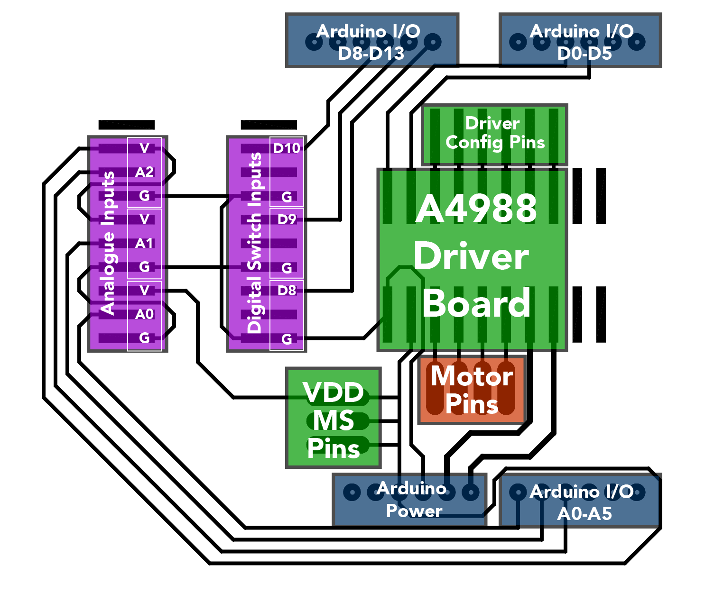

# Readme

This is a simple shield to mount an A4988 stepper driver board onto an Arduino Uno giving easy access to the configuration pins, connections to the motor, and also separate breakouts to attach switches and analogue inputs for motion control



Features:
* Mounting headers for a standard 'Stepstick'-style A4988 stepper motor driver
* Routes DIRECTION to Arduino pin D3, and STEP to Arduino pin D2
* Through-board male-female headers to fit an Arduino Uno R3
* 4 pin header breaking out pins 1B, 1A, 2A, 2B (reading left-right) to wire up to motor
* 3 pin header breaking out VDD line, so MS1, MS2, and MS3 can be pulled high to use micro-stepping modes
* 6 pin header breaking out the main driver configuration pins: SLEEP, RESET, MS3, MS2, MS1, ENABLE (reading left-right)
* One header to accept up to 3 digital inputs from buttons or end-stops (to Arduino I/O pins D10, D9, D8, reading top-bottom)
* One header to accept up to three analogue inputs for example from potentiometers (to Arduino I/O pins A2, A1, A0, reading top-bottom)

## Connecting the motor

The header labelled "Motor Pins" directly below the driver mounting headers is designed to take a 4-pin female-terminated motor cable. Left to right, the pins are: 1B, 1A, 2A, 2B.

## Using micro-stepping modes

The A4988 datasheet includes a truth table to show how you can access micro-step resolution down to 1/16 step. The pins have internal pull-down resistors, so you can activate each pin by connecting it to VDD. The MS1-3 pins are broken out directly from the board to the header above it ("Driver Config Pins"). There are 3 pins all connected to VDD on one header ("VDD MS Pins") next to the motor pin header. Use jumper wires to connect these to the micro-stepping pins, and access these modes.


|  MS1  |  MS2  |  MS3  | Microstep Resolution | Excitation Mode |
| :---: | :---: | :---: | :------------------: | :-------------: |
|   L   |   L   |   L   |      Full Step       |     2 Phase     |
|   H   |   L   |   L   |      Half Step       |    1-2 Phase    |
|   L   |   H   |   L   |     Quarter Step     |   W1-2 Phase    |
|   H   |   H   |   L   |     Eighth Step      |   2W1-2 Phase   |
|   H   |   H   |   H   |    Sixteenth Step    |   4W1-2 Phase   |

## Using – or not using – sleep and reset modes

The SLEEP and RESET pins can be used to enter different modes (detailed in the datasheet). If you're not using these modes, and therefore not connecting the pins, they have a floating voltage and can cause problems. If you're not using these mode, connect these two pins with a wire to pull them both high.

## External inputs

As well as the pins for the driver itself, there are two header to allow other components to be connected more easily.

### Using the digital inputs

These inputs connect one side of the switch to GND, the other to the input pin. So you should set the internal pull-up resistor in your code to use them:

```
pinMode(10, INPUT_PULLUP);
pinMode(9, INPUT_PULLUP);
pinMode(8, INPUT_PULLUP);
```

Note the comments below ("Unused header pins") about the arrangement on pins on this header.  Specifically, the top pin is not used.

#### Digital inputs pin table (top-bottom)

|  Pin  | Connection |
| :-----: | :------: |
|    1    | (unused) |
| Input 1 |          |
| :-----: | :------: |
|    2    |   D10    |
|    3    | (unused) |
|    4    |   GND    |
| Input 2 |          |
| :-----: | :------: |
|    5    |    D9    |
|    6    | (unused) |
|    7    |   GND    |
| Input 3 |          |
| :-----: | :------: |
|    8    |    D8    |
|    9    | (unused) |
|   10    |   GND    |


### Using the analogue inputs

There are 3 sets of 3 pins to allow the connection of 3 analogue inputs. Each set is wired up (top-bottom) VDD – Analogue input – GND. The analogue inputs used are (top-bottom) A2, A1, A0.

Note the comments below about the arrangement on pins on this header. Specifically, the top pin is not used.

#### Analogue inputs pin table (top-bottom)

|  Pin  | Connection |
| :---: | :------: |
|   1   | (unused) |
|   2   |   VDD    |
|   3   |    A2    |
|   4   |   GND    |
|   5   |   VDD    |
|   6   |    A1    |
|   7   |   GND    |
|   8   |   VDD    |
|  19   |    A0    |
|  10   |   GND    |


## Unused header pins

The driver is mounted on the left-most 8 pins of the dual 10-pin headers in the centre of the board (DIRECTION pin top-left). Ignore the two pins at the right of each header.

Analogue and digital inputs are connected in 3 sets of 3 pins each. This might be a slightly odd arrangement for the digital inputs, which only need two signals, but I'm using these for my end-stop switches, which have three terminals, and I want maximum flexibility in how I connect them. This is likely to change in a future version. Ignore the top pin of each of these headers.

The choice of header on this board is largely driven by what I have available to me: 10-pin SMD female headers, and 6-pin through-board female headers. That's why there are unused pins on some of the headers, and why not all of the Arduino pins are exposed through the shield. If you have a better selection of header, feel free to adjust this design.
