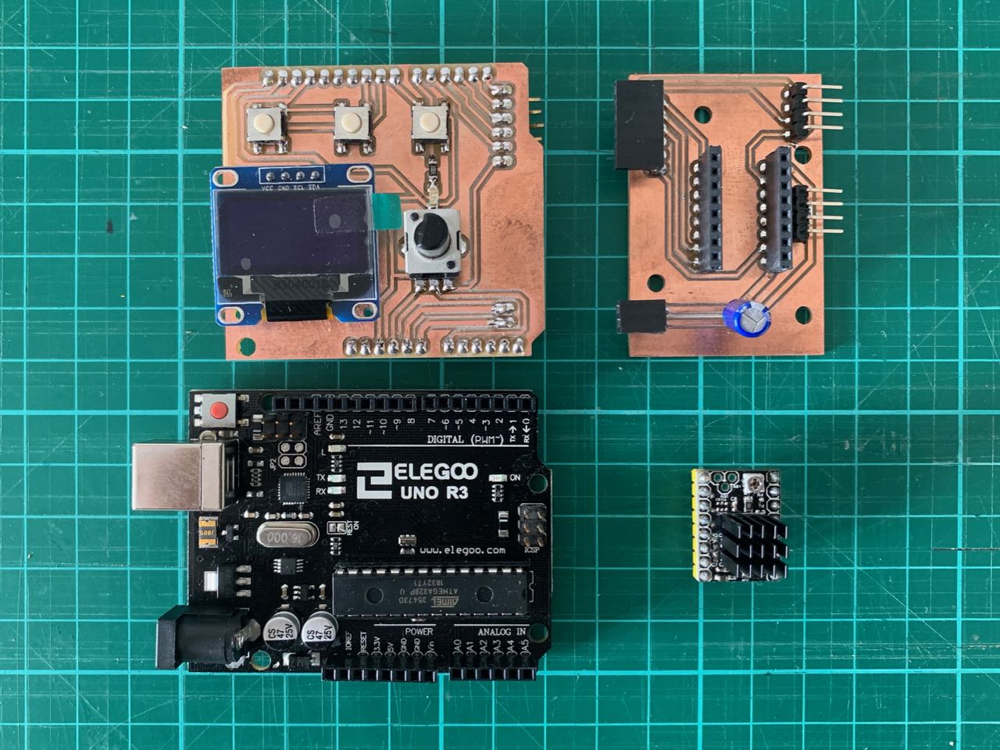
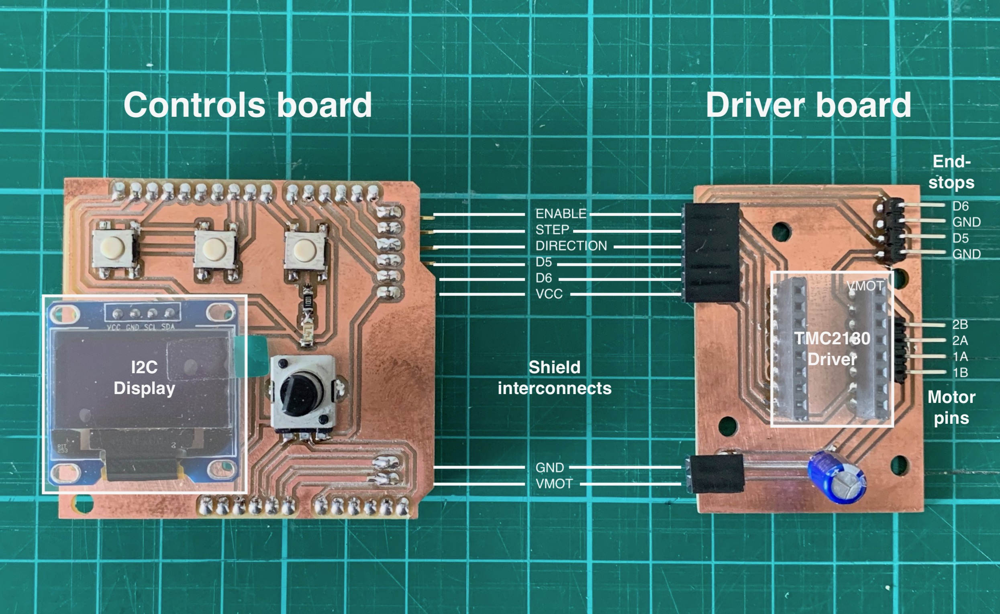

# Readme

This is version 2 of a board to use a stepper driver (a TMC2130) with an Arduino Uno to control a stepper motor for a <a href="https://andrewsleigh.com/fab-slider/">camera slider</a>.

The board is in two parts for easier mounting. This diagram shows how they're connected. The pins on the right are to connect to the motor and endstops which are assumed for this design to be outside of the housing for the boards.

This board design is documented in much more detail in my journal here:

<https://andrewsleigh.com/fab-slider/v2-shield/>
