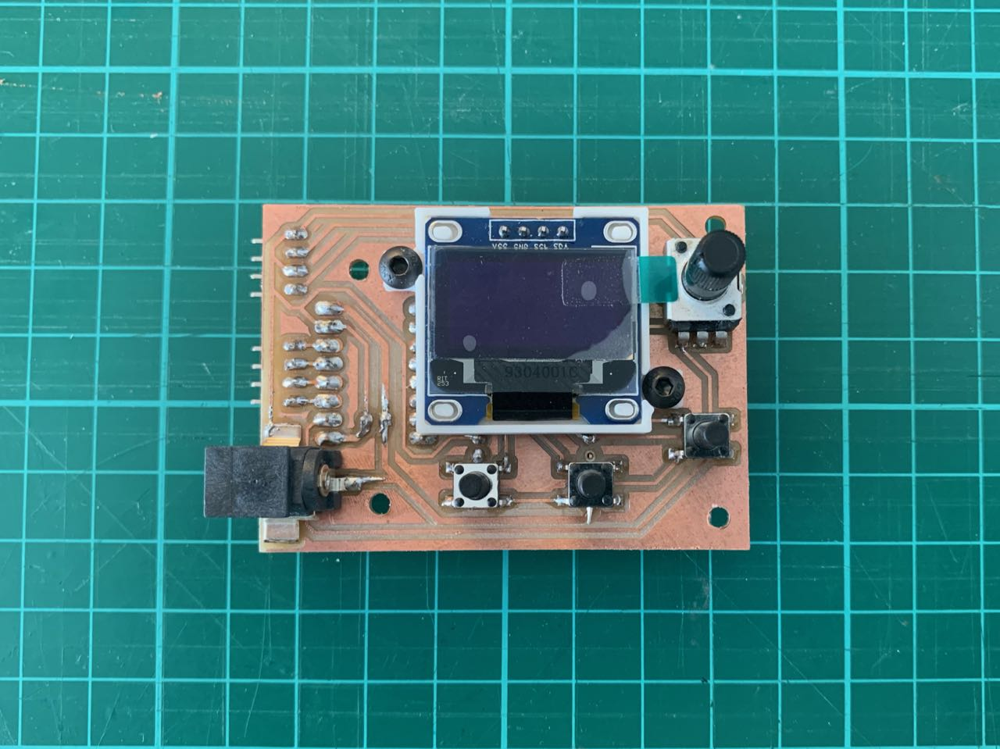
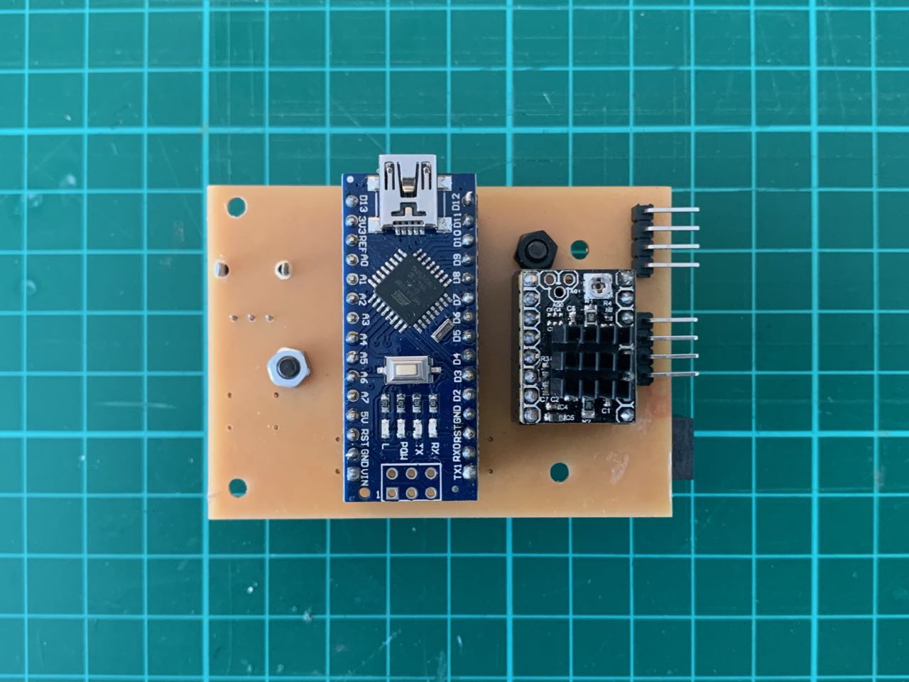
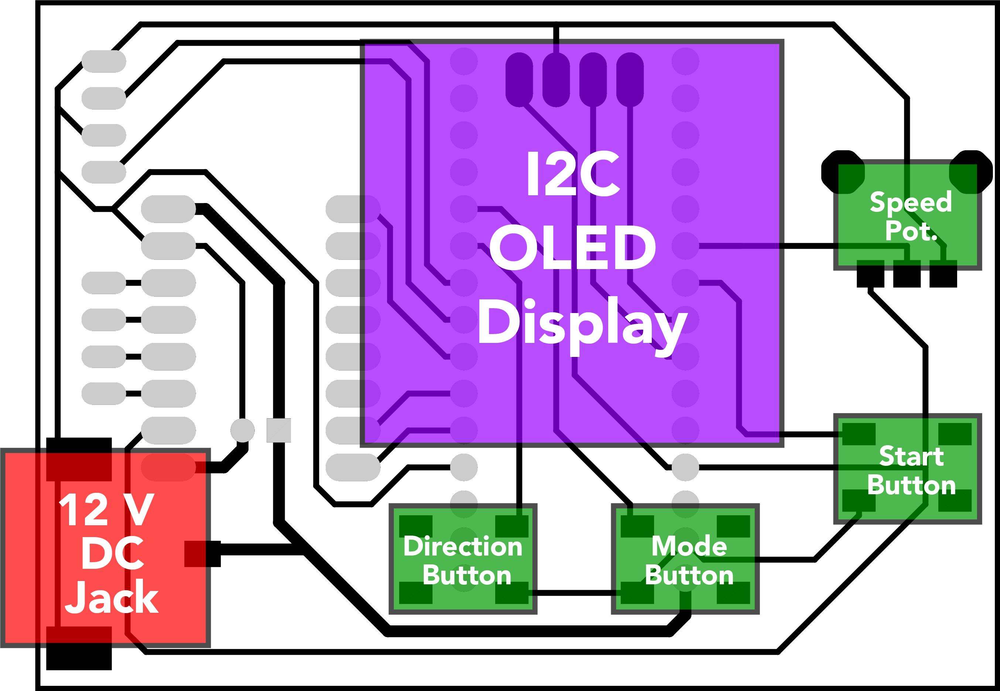
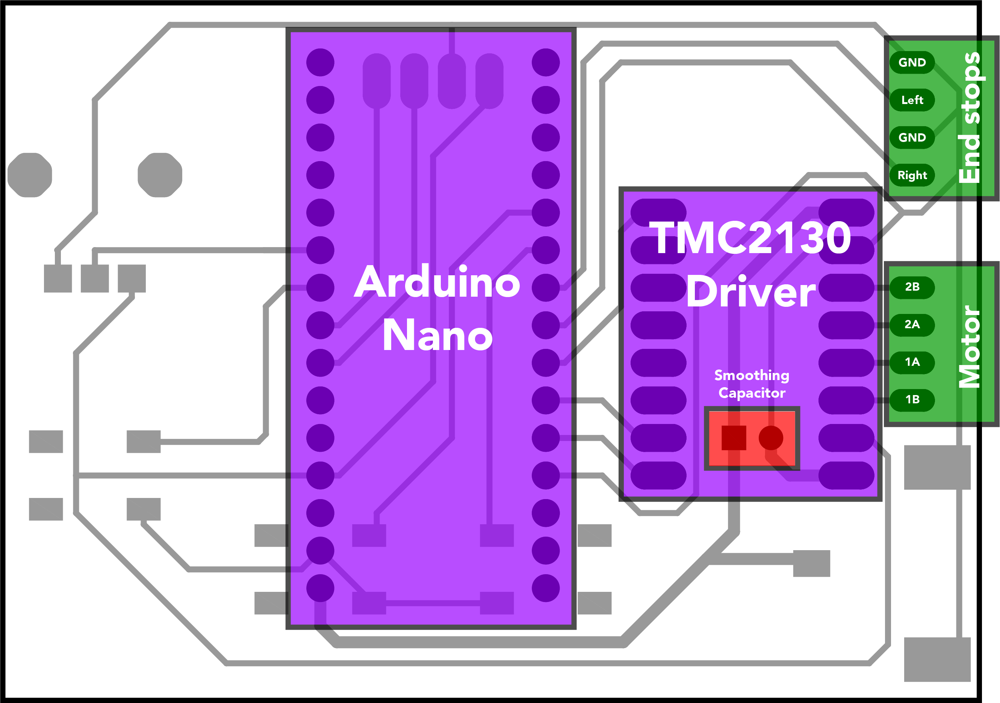

# Readme

<!--  -->

This is version 3 of a board to use a stepper driver (a TMC2130) with an Arduino Uno to control a stepper motor for a <a href="https://andrewsleigh.com/fab-slider/">camera slider</a>.

The front (copper side) of the board, with all traces and user-facing components:

The back side of the board, which just has female headers for the Nano and driver module, and male headers for connections to the motor and end stops:

(Not visible here is the smoothing capacitor underneath the driver module.)

## Layout diagrams

### Front

### Back

This is the release version of the board design. It works with the release version of the Arduino code at [../../../arduino-code/v2](../../../arduino-code/v2).

As well as the passive components, you'll need an Arduino Nano, an I2C 128x64 OLED module and a TMC2130 stepper driver. The code could be adapted to work with an A4988-based driver, which should be compatible with this board.

The full story of how I came to this board design is documented in the [journal](https://andrewsleigh.com/fab-slider/), in particular:

* [Designing a new stepper driver and controls board](https://andrewsleigh.com/fab-slider/v2-shield/) (v2)
* [Designing a new board — again](https://andrewsleigh.com/fab-slider/v3-shield/) (v3)