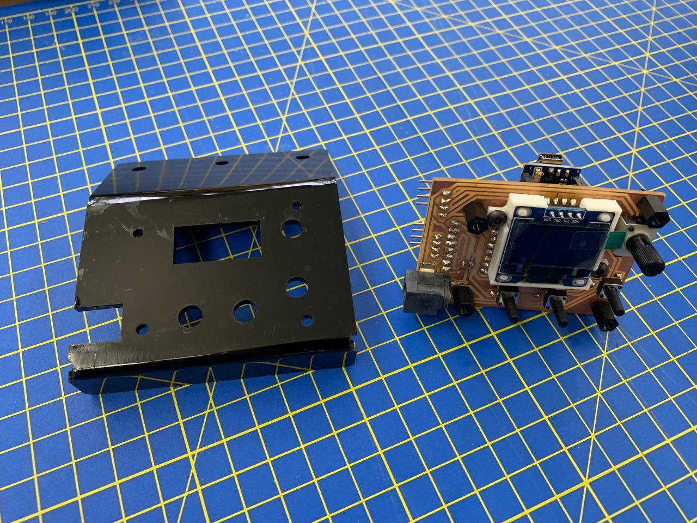

# Readme

This is version 3 of a board to use a stepper driver (a TMC2130) with an Arduino Uno to control a stepper motor for a <a href="https://andrewsleigh.com/fab-slider/">camera slider</a>.

This is the release version of the board design. It works with the release version of the Arduino code at [../../arduino-code/v2](../../arduino-code/v2).

As well as the passive components, you'll need an Arduino Nano and a TMC2130 stepper driver. The code could be adapted to work with an A4988-based driver, which should be compatible with this board.